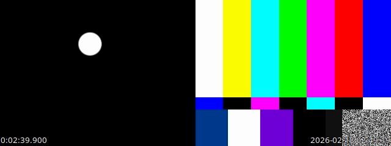

Video Data Record
=================

A multi-stream video record application using C++, GStreamer, and GTKmm. It allows creating flexible video streams via JSON configuration, provides live previews, and supports synchronized recording with timestamps. ROS topics can also be recorded along the videos. Note that the videos are recorded directly from the source using GStreamer and don't rely on ROS topics.

The application also integrates with ROS2 for remote control and status monitoring.

.. toctree::
   :maxdepth: 2
   :caption: Contents:

   prerequisites
   installation
   usage
   post_processing
   ros2_integration

Indices and tables
==================

* :ref:`genindex`
* :ref:`search`
