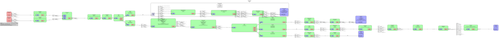
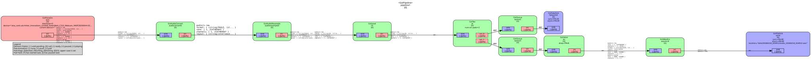

Usage
=====

1. Configuration
----------------

Define your video sources in a JSON file. The configuration format is defined in the JSON schema.

**Example config.json:**

.. code-block:: json

    {
      "data_directory": "data",
      "record_audio": true,
      "ros_topics": [
        "/PSM1/measured_cp",
        "/PSM1/measured_cv",
        "/PSM1/jaw/measured_js"
      ],
      "stages": [
        "calibration",
        "exercise_1",
        "exercise_2"
      ],
      "videos": [
        {
          "name": "camera_1",
          "stream": "v4l2src device=/dev/video0 ! video/x-raw,width=640,height=480,framerate=30/1",
          "record": true,
          "timestamp_overlay": true,
          "encoding": {
            "width": 320,
            "height": 240,
            "bitrate": 5000
          }
        },
        {
          "name": "test_pattern",
          "stream": "videotestsrc pattern=smpte75",
          "record": false
        }
      ]
    }

Configuration File Composition
------------------------------

Configuration files can reference other configuration files using the ``configuration_files`` field. This allows you to organize and reuse configurations across different setups.

**Example with configuration_files:**

.. code-block:: json

    {
      "data_directory": "data",
      "configuration_files": [
        "devices/PSM1.json",
        "devices/PSM2.json",
        "cameras/stereo.json"
      ]
    }

**How it works:**

- Referenced configuration files are loaded and merged recursively.
- Paths in ``configuration_files`` are resolved relative to the current config file's directory.
- If a file is not found relative to the current config, it falls back to searching relative to the master config file's directory.
- All ``videos``, ``ros_topics`` and ``stages`` from referenced files are combined (deduplicated).
- The ``data_directory`` from the last processed file is used.
- Circular dependencies are automatically detected and prevented.

GStreamer Pipelines
-------------------

The application generates optimized GStreamer pipelines for each video stream based on the configuration and available hardware acceleration.

Video Pipeline:

Audio Pipeline:

This modular architecture allows for low-latency preview while simultaneously performing high-bitrate encoding and ROS topics overlay without stalling the capture.

2. Running the Record
---------------------

After building your workspace, run the record using ``ros2 run``:

.. code-block:: bash

    ros2 run data_collection record -c config.json

Multiple configuration files can be loaded and merged. You can collect multiple video streams and multiple ROS topics defined in existing files (e.g. ``PSM1.json``). This allows users to re-use configuration files for each component used for a given experimental setup.

.. code-block:: bash

    ros2 run data_collection record -c PSM1.json -c PSM2.json -c SUJ.json -c video_config.json

**Note:** Configuration file paths can be relative to your current working directory or absolute paths.

3. Stages Feature
-----------------

If the ``stages`` field is provided in the configuration, a "Stages" list will appear on the right side of the GUI.

- **File Naming:** When a stage is selected, its name is appended to the session directory and all recorded files. The naming convention for video files is ``camera_name_YYMMDD_HHMMSS_stage.mp4``.
- **Auto-Advancement:** After stopping a recording, the application automatically selects the next stage in the list.
- **Looping:** When the last stage is completed, it wraps back to the first stage.
- **Manual Override:** Users can click any stage in the list to select it for the next recording (selection is disabled while recording is in progress).
- **Hardware-Accelerated Encoding:** Automatically detects and uses available hardware encoders (NVENC, VAAPI) to minimize CPU usage.
- **Nanosecond Precision:** All video frames are timestamped in nanoseconds since epoch, ensuring perfect alignment with ROS2 bags.
- **Session Metadata:** An ``index.json`` file is created in each session directory, storing video/bag durations and metadata.
